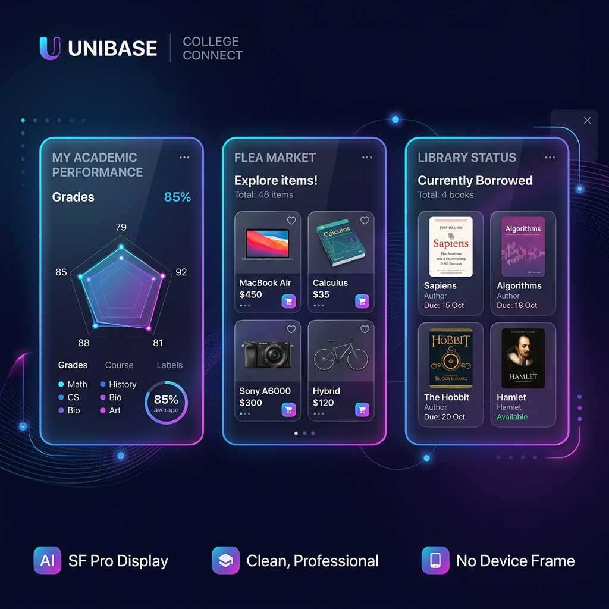

# 大学生综合服务开放平台 (College Platform) 🎓



这是一款专为高校在校师生打造的**一站式大学生综合服务开放平台**。系统集成了校园生活与学术高频场景，提供包括二手跳蚤市场、图书馆借阅管理、个人教务成绩加权分析以及学术文献分享等核心板块。

项目采用现代前后端分离架构，致力于提供**极致的用户体验、严谨的代码结构与规范的开发流程**。

---

## 🌟 技术栈与核心特性

### 🛠 后端技术栈 (Backend Tech Stack)
*   **核心框架**：`Java 17` + `Spring Boot 3.2.x`
*   **持久层**：`MyBatis-Plus` 提供了强大的 SQL 构造器与生命周期拦截
*   **安全认证**：`JWT (JSON Web Token)` 无状态分布式鉴权 + `BCrypt` 强哈希密码加密
*   **缓存与性能**：`Redis 7.0` 实现热点数据快速缓存与防刷限流
*   **开发辅助**：`Lombok` 自动生成样板代码，并采用构造器注入（`Constructor Injection`）以增强代码可测试性

### 🎨 前端技术栈 (Frontend Tech Stack)
*   **构建工具**：`Vite 5.x` 极速热更新构建环境
*   **开发语言**：`TypeScript` 严格类型保护（`strict: true`），杜绝运行时类型隐患
*   **核心视图**：`Vue 3.x` (利用 `<script setup lang="ts">` 单文件组件模式)
*   **状态管理**：`Pinia` + 持久化插件
*   **路由中心**：`Vue Router` 配合全局鉴权守卫
*   **UI 库与样式**：`Element Plus` 圆角微扁平组件 + `TailwindCSS` 原子化样式设计

---

## 📦 核心功能板块

| 板块名称 | 功能描述 | 亮点实现 |
| :--- | :--- | :--- |
| 🔑 **统一安全与用户中心** | 基于 JWT 的全栈无状态认证与 RBAC 权限控制，支持修改个人信息。 | 密码密文存储，登录防暴刷机制。 |
| 🛒 **二手跳蚤市场** | 校园专属的闲置物品交易区，支持分类展示、图片上传与橱窗管理。 | 状态机控制流转（在售、已锁、已售），轻量化留言板交互。 |
| 📚 **图书馆借阅辅助** | 书籍检索、在馆量实时监控、借阅时间轴展示与一键续借。 | 超期红字警示，每本书限制仅可续借 1 次。 |
| 📊 **成绩管理与学情分析** | 自动完成学分与绩点加权对冲计算，生成可视化学情走势图。 | 结合 **ECharts** 生成学业优劣势雷达图，挂科课程置顶报警。 |
| 🔬 **学术文献期刊共享** | 聚合前沿学术期刊论文目录，支持个人文献夹管理与学术探讨。 | 个人课题分类文献夹，支持父子层级的盖楼式评论树。 |

---

## 📂 项目结构

### 后端结构目录
```text
src/main/java/com/xuzhentao
 ├── config/      # 全局配置类 (CORS, MyBatis-Plus, WebMvc配置等)
 ├── controller/  # RESTful 接口层 (按业务模块划分)
 ├── service/     # 业务逻辑层接口及实现子包 (impl)
 ├── mapper/      # MyBatis-Plus 数据访问层接口
 ├── model/       # 数据模型层 (entity: 数据库实体, dto: 请求体传参, vo: 视图展示)
 ├── security/    # 安全认证核心、JWT拦截器与上下文工具
 ├── exception/   # 自定义业务异常 (BusinessException) 及全局处理器
 └── utils/       # 通用工具类
```

### 前端结构目录
```text
frontend/src/
 ├── api/         # 接口请求封装 (基于 Axios 与后端 Controller 对应)
 ├── assets/      # 静态资源文件 (图片、全局样式表)
 ├── components/  # 全局可复用的公共组件
 ├── router/      # Vue Router 路由配置及前端权限守卫
 ├── store/       # Pinia 状态管理 (用户信息、系统配置)
 ├── utils/       # 辅助工具函数 (Axios请求实例、格式化工具)
 └── views/       # 业务视图核心页面 (Home, Market, Library, Grade, Journal等)
```

---

## 🚀 快速启动指南

### 1. 准备工作
*   安装 **JDK 17** 或更高版本
*   安装 **Node.js v18.x** 或更高版本
*   安装 **MySQL 8.0+**，并确保开启了 JSON 字段支持
*   安装 **Redis** 服务并保持后台运行

### 2. 数据库配置
1. 连接 MySQL 数据库，执行以下命令创建数据库：
   ```sql
   CREATE DATABASE `college_platform` DEFAULT CHARACTER SET utf8mb4 COLLATE utf8mb4_unicode_ci;
   ```
2. 导入初始化 SQL 脚本：导入并运行 [init.sql](file:///Users/xuzhentao/IdeaProjects/College/src/main/resources/db/init.sql) 脚本完成表结构和初始数据的建立。
3. 初始内置管理员账户：
   *   学号：`admin`
   *   密码：`admin123`

### 3. 运行后端服务
1. 打开后端配置文件：[application.yml](file:///Users/xuzhentao/IdeaProjects/College/src/main/resources/application.yml)
2. 修改 `spring.datasource` 中的数据库连接地址、用户名和密码。
3. 修改 `spring.data.redis` 连接配置。
4. 在项目根目录下执行以下 Maven 命令启动服务：
   ```bash
   mvn clean spring-boot:run
   ```

### 4. 运行前端服务
1. 进入前端目录：
   ```bash
   cd frontend
   ```
2. 安装依赖：
   ```bash
   npm install
   ```
3. 启动开发服务器：
   ```bash
   npm run dev
   ```
4. 访问前端控制台输出的本地服务地址（通常为 `http://localhost:5173`）即可进入系统。

---

## 🤝 Git 协作与提交规范

项目采用 Git Flow 协作分支模型管理：
*   `main`：生产稳定发布分支
*   `feature/xxx`：新功能开发分支
*   `fix/xxx`：缺陷修复分支

团队成员提交 Commit Message 时必须遵循如下统一格式规范：
*   `feat: [模块] 新增 xxx 功能`
*   `fix: [模块] 修复 xxx 问题`
*   `refactor: 重构/优化 xxx 逻辑`
*   `docs: 更新文档（如 README 等）`
