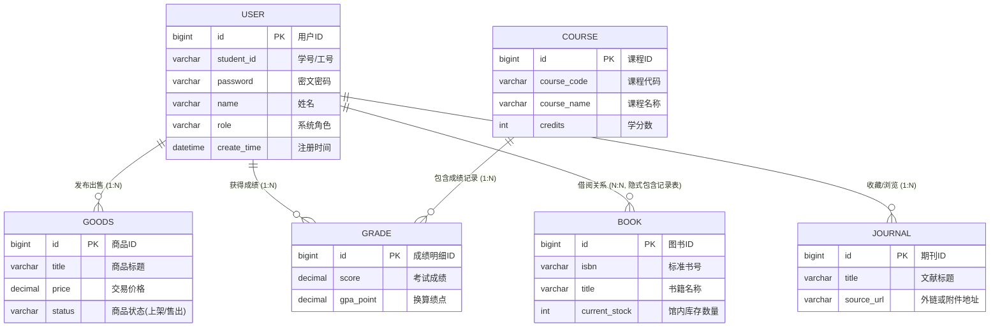

# 大学生综合服务开放平台系统 - 核心数据库 E-R 图

以下是系统的核心业务模块全局实体关系映射（E-R 图）：

```mermaid
erDiagram
    %% 实体定义
    USER {
        bigint id PK "用户ID"
        varchar student_id "学号/工号"
        varchar password "密文密码"
        varchar name "姓名"
        varchar role "系统角色"
        datetime create_time "注册时间"
    }
    
    GOODS {
        bigint id PK "商品ID"
        varchar title "商品标题"
        decimal price "交易价格"
        varchar status "商品状态(上架/售出)"
    }
    
    BOOK {
        bigint id PK "图书ID"
        varchar isbn "标准书号"
        varchar title "书籍名称"
        int current_stock "馆内库存数量"
    }
    
    COURSE {
        bigint id PK "课程ID"
        varchar course_code "课程代码"
        varchar course_name "课程名称"
        int credits "学分数"
    }
    
    GRADE {
        bigint id PK "成绩明细ID"
        decimal score "考试成绩"
        decimal gpa_point "换算绩点"
    }
    
    JOURNAL {
        bigint id PK "期刊ID"
        varchar title "文献标题"
        varchar source_url "外链或附件地址"
    }

    %% 关系线条定义 (1对多, 多对多由中间表拆解等)
    USER ||--o{ GOODS : "发布出售 (1:N)"
    USER ||--o{ GRADE : "获得成绩 (1:N)"
    COURSE ||--o{ GRADE : "包含成绩记录 (1:N)"
    USER ||--o{ BOOK : "借阅关系 (N:N, 隐式包含记录表)"
    USER ||--o{ JOURNAL : "收藏/浏览 (1:N)"
```

_注：本图采用 Mermaid 语法编写，在 IDEA 或兼容的 Markdown 阅读器中即可预览渲染为连线关系图。_
